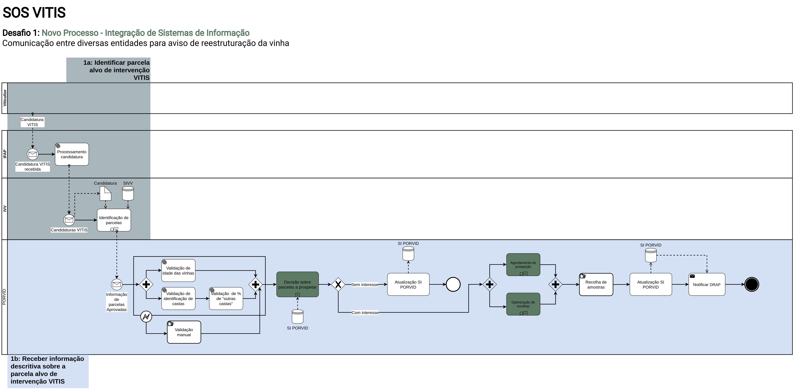

# Desafio 1 - Resumo

## Desafio

**1.** Comunicação entre diversas entidades para aviso de reestruturação da vinha

**1a.** Identificar parcela alvo de intervenção VITIS

**1b.** Receber informação descritiva sobre a parcela alvo de intervenção VITIS

**Objetivo:** Aviso de reestruturação da vinha em determinada parcela.

## Solução

A PORVID desempenha em Portugal um papél fundamental na conservação da variabilidade das castas da videira. Nas "vinhas velhas" encontramos videiras que encerram preciosas amostras da diversidade genética das castas antigas de Portugal e são um importante recurso para a resiliência e capacidade de adaptação a alterações ambientais, como as alterações climáticas.  
Para aumentar a abrangência e eficácia das suas atividades, ao mesmo tempo que garantindo que os viticultores possam continuar a renovar as suas vinhas, por exemplo através do VITIS, sem receio de que seja perdido o património ancestral nelas encerrado, a PORVID tem em vista alavancar informação já existente e dispersa por outras organizações para alimentar as suas atividades.

Adotando um modelo de trabalho colaborativo e de co-criação com todos os stakeholders, um processo de trabalho que define atividades e responsabilidades de todas as instituições foi desenvolvido. Partindo dos processos atuais este novo modelo foi desenhado com flexibilidade em mente, para servir como guia para possibilitar uma simples e profícua a passagem da informação entre instituições.

A análise do processos de negócio internos da PORVID levou também à identificação de alguns pontos de intervenção num período mais alargado. Estes levaram ao desenvolvimento de um segundo processo de negócio, e a um conjunto de recomendações de melhoria a médio/longo prazos, em que a digitalização de atividades e um maior foco numa gestão de informação sustentável são tidos em conta. Uma descrição destes pode ser encontrado na secção [Recomendações](/Recomendacoes/recomendacoes/).

<figure markdown>
  
  <figcaption>Diagrama BPMN Desafio 1 - Novo Processo</figcaption>
</figure>

<figure markdown>
  
  <figcaption>Diagrama BPMN Desafio 1 - Novo Processo Digitalizado</figcaption>
</figure>
