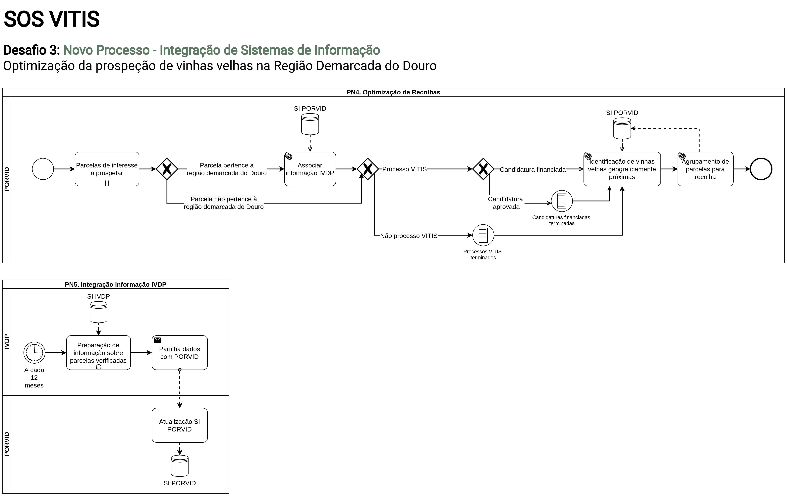

# Desafio 3 - Resumo

## Desafio

**3.** Optimização da prospeção de vinhas velhas na Região Demarcada do Douro

**Objetivo:** Optimização da rota de prospeção.

## Solução

Uma vez identificada a parcela alvo de intervenção VITIS, confirmando-se o interesse em prospetar, e recebida a autorização do viticultor, poderá ser útil à PORVID, numa lógica de optimização de processos e recursos, aceder ao acervo de informação de vinhas classificadas como “Vinhas Velhas”, detido pelo IVDP, por forma a identificar parcelas de interesse para prospeção que estejam geograficamente próximas. Desta forma, o que poderia ser apenas uma deslocação urgente para prospectar uma parcela alvo de VITIS, poderá ser optimizada para visitas estratégicas a multi-parcelas para recolha de material de interesse.

<figure markdown>
  
  <figcaption>Diagrama BPMN Desafio 3 - Novo Processo</figcaption>
</figure>

<figure markdown>
  
  <figcaption>Diagrama BPMN Desafio 3 - Novo Processo Digitalizado</figcaption>
</figure>
