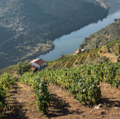

# Desafio 3 - Optimização da prospeção de vinhas velhas na Região Demarcada do Douro

<figure markdown> 
  
</figure>

## Objetivo 
Optimização da rota de prospeção.

## Stakeholders

+ PORVID
+ IVDP
+ Viticultor

## Processo

Uma vez identificada a parcela alvo de intervenção VITIS, confirmando-se o interesse em prospetar, e recebida a autorização do viticultor, poderá ser útil à PORVID, numa lógica de optimização de processos e recursos, aceder ao acervo de informação de vinhas classificadas como “Vinhas Velhas”, detido pelo IVDP, por forma a identificar parcelas de interesse para prospeção que estejam geograficamente próximas. Desta forma, o que poderia ser apenas uma deslocação urgente para prospectar uma parcela alvo de VITIS, poderá ser optimizada para visitas estratégicas a multi-parcelas para recolha de material de interesse.

## Entregável

Desenho de um modelo de trabalho, uniformizador e colaborativo, com uma clara definição de processos e responsabilidades, capaz de minimizar a entropia entre instituições e possibilitar uma simples e profícua a passagem da informação entre os stakeholders.
