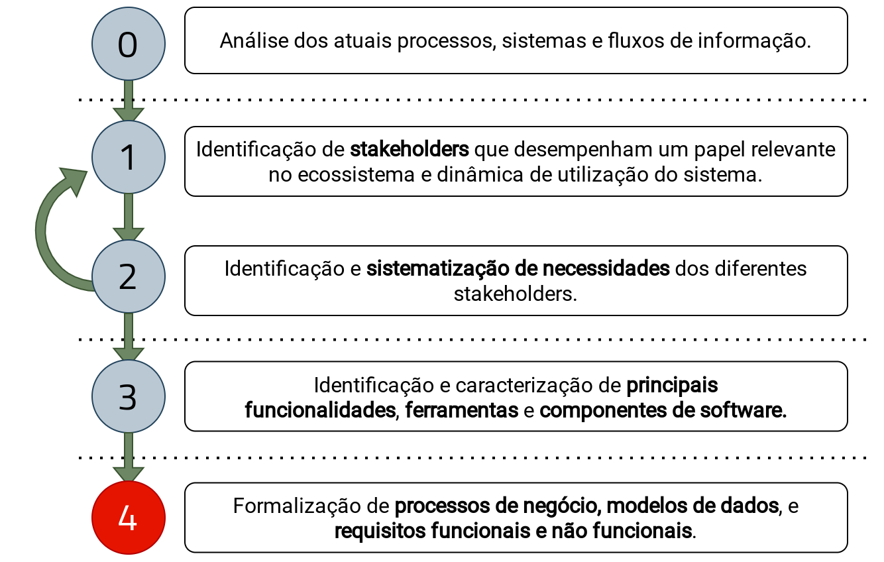

!!! info "Apresentação"
    A apresentação utilizada para introduzir metodologia e entregáveis disponível [aqui](documentos/intro_metod_29-10-2021.pdf)

## 0. Análise dos atuais processos, sistemas e fluxos de informação.

Processo inicial que consistena no levantamento de toda a informação prévia sobre atuais processos de negócio envolvidos nos três desafios, sistemas de informação de todas as organizações com que haja necessidade de interagir e fluxos de informação já existentes tanto intra-organizacionais, como intra-organizacionais. Passo importante para uma definição concreta do **âmbito** e **objetivos**.

## 1. Identificação de stakeholders

Quem são os intervenientes das diferentes atividades identificadas no passo anterior?  
Neste passo, todos os _stakeholders_ devem ser identificados, a diferentes níveis organizacionais. Este passo deverá ser exaustivo de forma a assegurar que todas as atividades incluidas na solução final são contempladas.

## 2. Identificação e sistematização de necessidades dos diferentes stakeholders.

Após a identificação de _stakeholders_, é então necessário perceber quais as suas necessidades perante os três desafios apresentados. Este passo conclui uma caracterização completa de todos os _stakeholders_, fundamental para assegurar a abrangência da solução final.

## 3. Identificação e caracterização de principais funcionalidades, ferramentas e componentes de software.

Nesta fase inicia-se a formalização dos principais componentes que irão sustentar a solução dos desafios com o desenho das funcionalidades e ferramentas, materializadas em software. Este quer-se ainda um trabalho iterativo com todos os parceiros de forma a que todos os componentes possam ser validados.

## 4. Formalização de processos de negócio, modelos de dados, e requisitos funcionais e não funcionais.

Nesta ultima fase são exaustivamente descritos todos os componentes que integrarão os entregáveis.  
Neste sentido serão desenvidos processos de negócio (em notação BPMN) intra-organizacionais, que integrem as novas tarefas a serem conduzidas para a implementação da solução desenhada; a descrição do modelo de dados que irá funcionar como pacote de informação a ser transmitido entre organizaçãoes, depontado por novos processos de restruturação das vinhas; e finalmente um documento de requisitos que descreve em detalhe _funções do sistema_, as _suposições_ e _dependências_ utilizadas no seu desenho e todos os _requisitos específicos_, aqui incluindo tanto _requisitos funcionais_, como _requisitos de interface externa_ e _requisitos não funcionais_.
