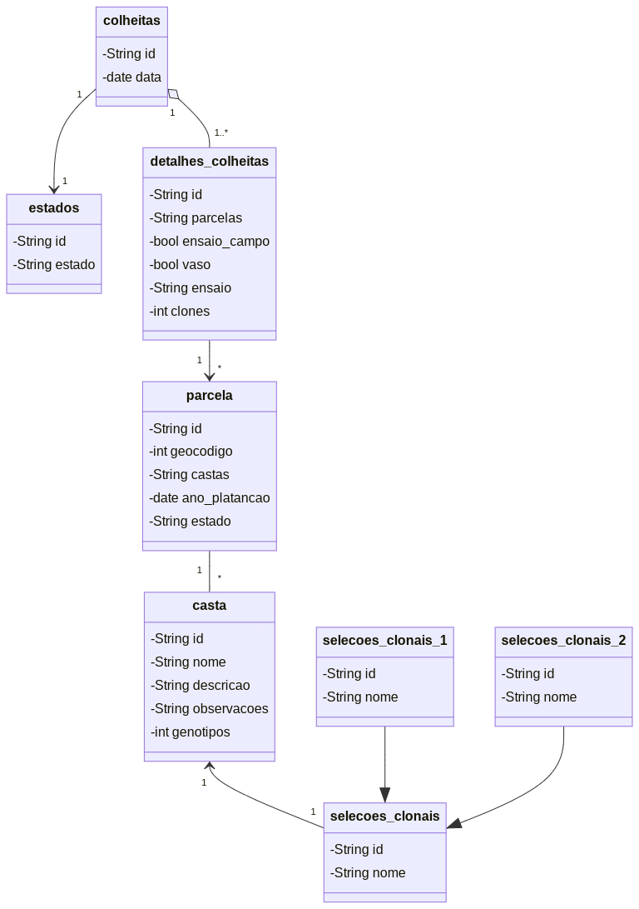

# Modelo de Dados

Modelo de dados desenhado com base nas discussões mantidas com a PORVID.  
Descrito em notação [UML](https://pt.wikipedia.org/wiki/UML), o modelo com como principais classes `colheitas`, `parcelas`, `castas` e `seleções clonais`. Sendo estas as principais abstrações a representar, de acordo com os processos de negócio da PORVID, as suas relações devem ser capazes de representar as principais interações.

Este modelo, não sendo otimizado e ainda numa fase inicial, deve ser encarado, em conjunto com os processos de negócio desenvolvidos nos anteriores desafios, com um ponto de partida para a implementação de práticas e sistemas de informação robustos na PORVID, capazes de representar o seu estado atual.

