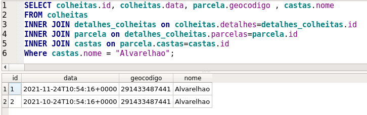

Com a análise do processos de negócio internos da PORVID foram identificados alguns pontos de melhoria, que levaram ao desenvolvimento de um conjunto de recomendações de melhoria a médio/longo prazo. Estes pontos são:

1. A dependência das atividades PORVID em conhecimento intrínseco;
2. A gestão de informação das atividades da PORVID.

### Dependência em Conhecimento Intrínseco

O conjunto de atividades até agora utilizadas permitiram à PORVID recolher e processar uma substancial coleção de amostras genéticas. No entanto estas atividades não podem ser consideradas como escaláveis ou sustentáveis ao longo prazo uma vez que são inteiramente dependentes de conhecimento intrínseco de atores chave na PORVID.  
Na descrição do [processo atual do Desafio 1](/Desafio 1/processo-atual/) foram identificadas três atividades cruciais que requerem a intervenção ativa de membros da PORVID: (1) a coleção de parcelas de interesse; (2) a decisão sobre parcelas a prospetar; e (3) o contacto com os viticultores ou DRAPs.

Apesar destes processos atuais manterem a PORVID relativamente flexível no que diz respeito à interação pontual com viticultores e até outras instituições, dificulta o estabelecimento de fluxos de informação formais. Com uma reestruturação destas atividades, suportada não em atores específicos, mas em processos e informação explícita a PORVID conseguirá não apenas estabelecer relações mais profícuas com outras instituições para assegurar o acesso a informação crucial para a sua missão, mas também assegurar uma maior visão sobre os seu processos para otimizar a sua eficácia e eficiência.

Se considerarmos a visibilidade que o projeto SOS VITIS traz para a PORVID como o primeiro passo no processo de minimização da dependência em conhecimento intrínseco, o segundo passo crucial é a implementação de processos e sistemas de gestão de informação.

### Gestão De Informação

## Recomendações

Um processo de digitalização eficaz dos diferentes processos da PORVID acenta em quatro pilares fundamentais:

1. Pessoas,
2. Informação,
3. Requisitos, e
4. Design.

### Pessoas

Pessoas são o núcleo de todos os processos de negócio e, sendo a PORVID tão dependente de conhecimento intrínseco, o ponto de partida para uma digitalização dos seus processos de negócio tem que inevitavelmente começar por aqui.  
Com este passo espera-se que seja possível definir de forma exaustiva:

1. os principais intervenientes dos diferentes processos;
2. o conhecimento intrínseco existente e associado a cada processo;
3. esquematização de atividades e sub-processos.

Apesar de o projeto SOS Vitis ter feito um avanço substancial neste campo para três processos e sub-processos específicos, o seu foco no programa VITIS não permitiu uma generalização ao nível que seria de esperar para uma abrangência completa.

### Informação

Baseado nos registos hoje mantidos, no conhecimento intrínseco existente, e assegurando a interoperabilidade com SIV e outros sistemas governamentais, a definição de uma arquitetura de informação suportada por um modelo de dados robusto e completo é fundamental para uma maior eficiência dos processos da PORVID.  

Uma versão preliminar, desenhada com todas as restrições impostas pelo projeto VITIS, de um modelo de dados foi desenhado e está disponível [aqui](/Recomendacoes/modelo-dados/). Desenhado apenas com base nas interações com a PORVID e nos processos de negócio desenhados, este modelo simples permite responder a perguntas como:

+ Listar os detalhes de todas as recolhas correspondetes à casta "Alvarelhao"

+ Listas todas as recolhas em espera
+ Listas todas as parcelas da Região Demarcada do Douro intervidas.
     
### Requisitos

A definição de requisitos é fundamental para o desenho e implementação de sistemas de informação que se adaptam ao seu meio e serem capazes de suportar a criação de valor. Havendo várias formas de encarar este processo, o trabalho de esquematização de processos e atividades iniciado pelo projeto SOS Vitis pode servir como um importante ponto de partida para este. O levantamento de necessidades de informação, funcionalidades e até um certa descrição de requisitos funcionais e não funcionais foi já aqui iniciado e deve ser tomado em conta.

### Design
