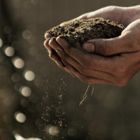

# Comunicação entre diversas entidades para aviso de reestruturação da vinha

<figure markdown> 
  
</figure>

## Objetivo 
Aviso de reestruturação da vinha em determinada parcela.

## Stakeholders

+ PORVID
+ IFAP
+ IVV
+ IVDP

## Processo

### 1a - Identificar parcela alvo de intervenção VITIS

A PORVID deseja ser avisada de quando são submetidos pedidos de reestruturação da vinha (VITIS).
Saber quais são as parcelas que vão sofrer uma intervenção VITIS é algo diretamente relacionado com o IVV, que, juntamente com o IFAP, serão as únicas entidades detentoras desse conhecimento. Será, portanto, necessário abordar o IVV no sentido de aferir a possibilidade de enviar, no momento da submissão VITIS (ou pedido de arranque da vinha), informação de localização da parcela, nomeadamente em geocódigo.

### 1b - Receber informação descritiva sobre a parcela alvo de intervenção VITIS

Uma vez recebida a informação da parcela alvo de intervenção, a PORVID terá, por sua vez, de avaliar a relevância dessa mesma parcela no contexto de preservação genética de vinhas. Para efetuar essa análise, será necessária a seguinte informação descritiva:

+ idade das vinhas;
+ castas que vão ser arrancadas.

Existem algumas considerações de importância sobre a granularidade e qualidade da informação requerida:

+ _Idade das vinhas:_ consegue-se saber o período, não se sabe o ano de plantação com exatidão. O ficheiro vitivinícola, inicialmente feito no terreno, identificou oano de plantação/idade da vinha num intervalo de tempo. Adicionalmente, o SIVV teve várias fases e várias evoluções. Na informação sobre a idade da vinha, substituiu-se “intervalo de tempo” por um ano específico. Esse ano, na maioria dos casos, será com base no primeiro ano do intervalo. Portanto, por exemplo, todas as vinhas de um intervalo de “1932-1970” poderão estar agora classificadas como sendo de 1932, tornando a informação hoje disponível no SIVV não muito fidedigna quanto ao ano de plantação/idade da vinha.
+ _Castas que vão ser arrancadas:_ castas menos comuns, diferentes da norma, dificilmente estarão identificadas nas descrições das parcelas de vinha. Essas castas de interesse para PORVID, poderão estar classificadas de forma agregada em “mistura de variedades” e/ou “outras brancas” e/ou “outras tintas”. Portanto, não se sabendo quais as castas específicas das parcelas a serem reestruturadas, será difícil determinar com exatidão se quais as parcelas de interesse para prospeção por parte da PORVID. Ainda assim, no SIVV, a classificação das castas presentes nas parcelas é feita em termos percentuais, o que implica que se consegue saber a percentagem de “outras brancas“ / “outras tintas” e percentagem de “mistura de variedades”. Esta informação percentual pode ser muito relevante porque:
    + se a percentagem de outras castas for muito alta (existem parcelas que na sua totalidade são “mistura de variedade”), há maior probabilidade de existir material interessante para a PORVID, justificando a prospeção;
    + se a percentagem de outras castas for muito pequena, pode não valer o esforço de deslocar até ao local para recolha de um espécime, embora sabendo que ainda assim possa existir material interessante.

## Entregável

Desenho de um modelo de trabalho, uniformizador e colaborativo, com uma clara definição de processos e responsabilidades, capaz de minimizar a entropia entre instituições e possibilitar uma simples e profícua a passagem da informação entre os stakeholders.
