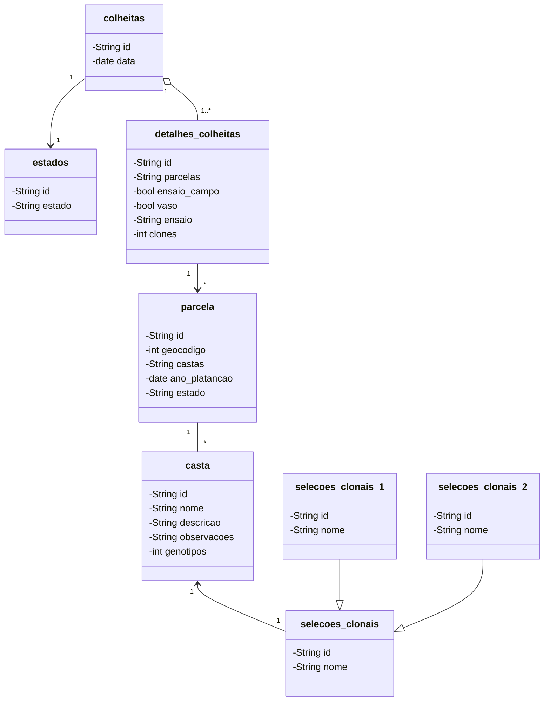

# Modelo de Dados

Modelo de dados desenhado com base nas discussões mantidas com a PORVID.  
Esta deve ser encarado como uma primeira versão para discussão.

```mermaid
classDiagram
	parcela "1" -- "*" casta
    colheitas "1" --> "1" estados
	detalhes_colheitas "1" --> "*" parcela
	casta "1" <-- "1" selecoes_clonais
	colheitas "1" o-- "1..*" detalhes_colheitas
	
	selecoes_clonais_1 --|> selecoes_clonais
	selecoes_clonais_2 --|> selecoes_clonais
	class colheitas{
		-String id
		-date data
	}
	class detalhes_colheitas{
		-String id
		-String parcelas
		-bool ensaio_campo
		-bool vaso
		-String ensaio
		-int clones
	}
	class casta{
		-String id
		-String nome
		-String descricao
		-String observacoes
		-int genotipos
	}
	class parcela{
		-String id
		-int geocodigo
		-String castas
		-date ano_platancao
		-String estado
	}
	class selecoes_clonais{
		-String id
		-String nome
	}
	class selecoes_clonais_1{
		-String id
		-String nome
	}
	class selecoes_clonais_2{
		-String id
		-String nome
	}
	class estados{
		-String id
		-String estado
	}
```

