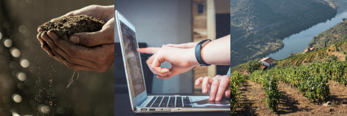

# Enquadramento

<figure markdown> 
  
</figure>

No âmbito da [Hackathon Douro & Porto 2021](https://hackdouroeporto.com/), que nesta edição tem como foco a sustentabilidade, está a ser desenvolvida uma colaboração com a PORVID, representada neste caso pelo Dr. António Graça, e o Engº Pedro Prata.

Tendo em conta a missão da PORVID, de conservação da variabilidade das castas portuguesas, estão a ser delineados desafios que permitam, individualmente, e como um todo, contribuir para a preservação genética de vinhas plantadas antes do início da seleção clonal em Portugal. Por vezes também denominadas como “vinhas velhas”, estas plantas encerram preciosas amostras da diversidade genética das castas antigas de Portugal, tornando-se, portanto, num importante recurso para a resiliência e capacidade de adaptação a alterações ambientais, como as alterações climáticas. 

Com este projecto pretende-se assim, na prática, que os viticultores possam continuar a renovar as suas vinhas, por exemplo através do VITIS, sem receio de que seja perdido o património ancestral encerrado nas mesmas.

## Parceiros

+ [Associação Portuguesa para a Diversidade da Videira (PORVID)](https://www.facebook.com/porvid.portugal/)
+ [Instituto dos Vinhos do Douro e Porto(IVDP)](https://www.ivdp.pt/)
+ [Instituto da Vinha e do Vinho(IVV)](https://www.ivv.gov.pt)
+ [Instituto de Financiamento da Agricultura e Pescas(IFAP)](https://www.ifap.pt/)

## Desafios

[#1 Comunicação entre diversas entidades para aviso de reestruturação da vinha](Hackathon/Desafios/desafio1)

[#2 Ferramenta de apoio à decisão para prospecção de castas antigas](Hackathon/Desafios/desafio2)

[#3 Optimização da prospeção de vinhas velhas na Região Demarcada do Douro](Hackathon/Desafios/desafio3)

## Resultados

Os resultados de cada um dos desafios foram divididos em três secções:

+ Resumo: descrição sucinta do processo e resultados obtido;
+ Processo atual: Descrição do modelo de trabalho atual da PORVID para o desafio em questão;
+ Novos processos: Descrição dos processos de negócio adaptados ao desafios apresentados.

| Desafio 1 | Desafio 2 | Desafio 3 |
| | | |
| [Resumo](/Desafio 1/resumo/) | [Resumo](/Desafio 1/resumo/) | [Resumo](/Desafio 1/resumo/) |
| [Processo Atual](/Desafio 1/processo-atual/) | [Processo Atual](/Desafio 2/processo-atual/) | NA |
| [Novos Processos](/Desafio 1/novos-processos/) | [Novos Processos](/Desafio 2/novos-processos/) | [Novos Processos](/Desafio 3/novos-processos/) |

Uma última secção de [Recomendações](/Recomendacoes/recomendacoes/) descreve um conjunto de considerações sobre os processos e atividades da PORVIR, apontando possíveis próximos passos para uma melhoria destes.

## Equipa

Henrique Diogo Silva  
Candidato a Doutoramento @ FEUP  
Investigador @ INESC TEC  
[hdsilva.pt](https://hdsilva.pt)  
[contacto@hdsilva.pt](mailto:contacto@hdsilva.pt)  
[henrique.d.silva@inesctec.pt](mailto:henrique.d.silva@inesctec.pt)  

