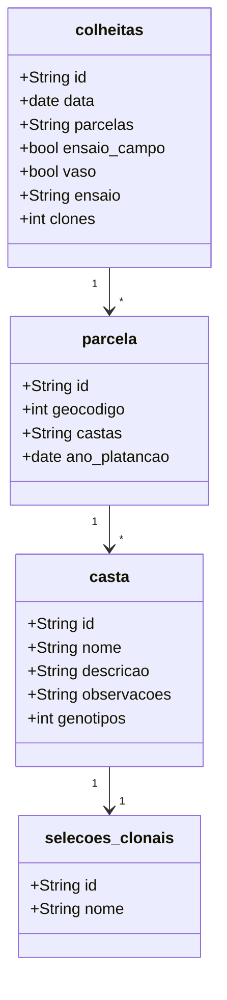
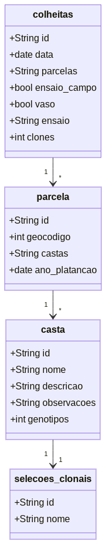

title: Modelo de Dados

# Modelo de Dados

Nesta página são mantidas as diferentes iterações do modelo de dados modelados para representar as diferentes atividades da PORVID.

## v0.01 - Versão preliminar

Versão preliminar do modelo de dados, representando apenas relações básicas.

