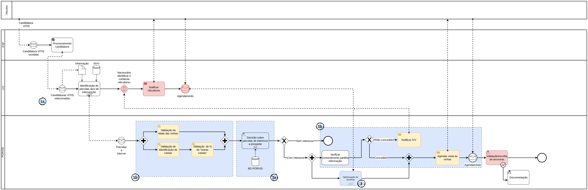
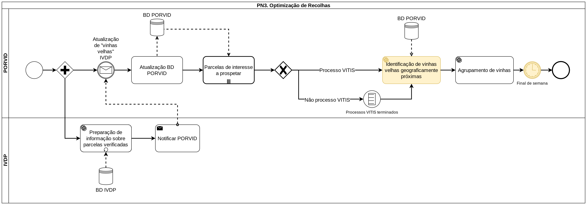
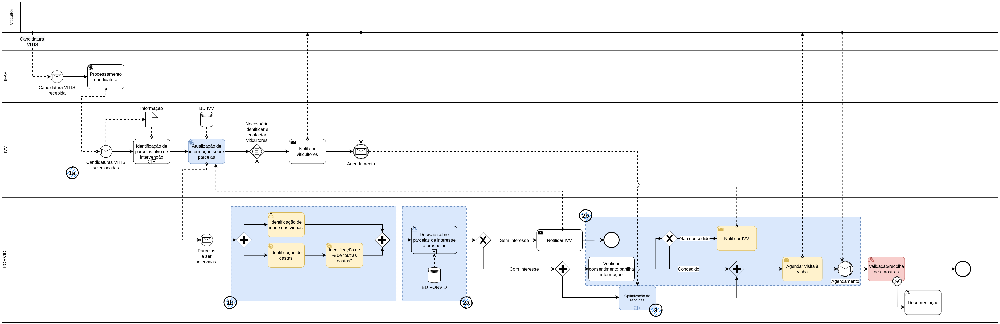
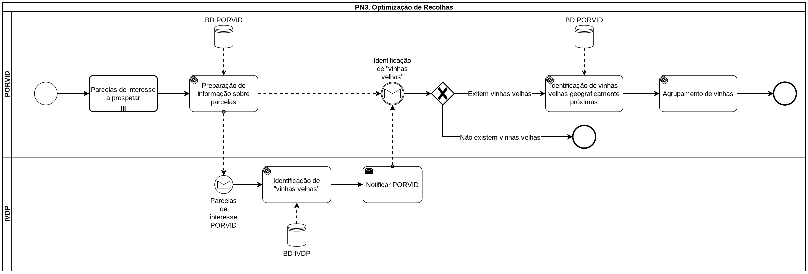

---
title: Processos
--- 

# Processos

Nesta página são mantidas as diferentes iterações dos processos de negócio inter e intra-organizacionais modelados como solução para os [três desafios](/#desafios).

_Legenda:_

**1a.** Identificar parcela alvo de intervenção VITIS  
**1b.** Receber informação descritiva sobre a parcela alvo de intervenção VITIS  
**2a.** Analisar a informação descritiva sobre a parcela alvo de intervenção VITIS  
**2b**.Agendar uma prospeção à parcela  
**3.** Optimização da rota de prospeção  

## v0.2 - Primeira iteração c/ IVDP

Primeira iteração do processo principal, alterado de acordo com os comentários da 1ª reunião individual com o IVDP.

!!! note "Editável"
    Diagramas editáveis (em [draw.io](https://diagrams.net)) disponíveis [aqui](diagramas/inicialv02.drawio).

### Modificações

+ Identificação do [Sistema De Informação Da Vinha E Do Vinho (SIVV)](https://sivv.ivv.gov.pt/) como principal sistema de informação do IVV
+ Alteração das atividades **1b** para "Validação"
    + Segundo o IVDP estas atividades não são estritamente necessárias, uma vez que esta é informação que chega à PORVID do IVV.
    + Uma vez que será difícil existir desenvolvimento do lado do IVV resolvi manter estas tarefas como _validação_ destes campos de informação, de forma a garantir que a informação que chega à PORVID é a esperada e é passível de ser utilizada no restante processo.
    + Estas devem ser **validadas com a PORVID**
+ Retirada a atividade de comunição com o IVV após uma parcela ser identificada como _Sem interesse_ de prospeção
    + Segundo o IVDP a simplificação do sistema e dos fluxos de informação é imperativa. Neste sentido, este tipo de notificações não são necessárias.
+ Retirada atividade intermédia _"Atualização de informação sobre parcelas"_
    + A sua principal função era atualizar o SIVV com informação chegada de outros _stakeholders_. Sem esta necessidade a tarefa perde sentido.
+ O seguimento do processo caso não haja um consentimento partilha de informação foi mantido temporariamente pelo IVV, no entanto existem dúvidas sobre esta possibilidade.
    + À espera de + informação para rever.
+ Removido o fluxo de informação da PORVID para o IVDP, aquando da decisão de uma parcela de interesse.
    + Foi discutido nesta reunião, que este processo pode ser simplificado com o IVDP a fornecer à PORVID toda a informação de castas velhas já identificadas, ficando assim este processamento do lado da PORVID.
+ Alterado o processo PN3 relativo ao IVDP para _passivamente_ fornecer informação à PORVID, de acordo com as parcelas já verificadas.
+ Adicionada lógica para processos VITIS terem precedência sobre processos não VITIS.
    + Há ainda a necessidade de identificar + detalhes sobre este processo:
        + **Qual é o _cut off_ para um agrupamento?** Temporal, por processo? **O que desponta a continuação deste processo?**
        + **Existem mais restrições para além da geográfica?**
+ Correção de erros ortográficos e de concordância

## v0.1

Versão inicial do processo inter-organizacional, modelado de acordo com a informação dos 3 desafios iniciais.  
Esta versão serve de suporte às discussões iniciais com os diferentes parceiros, guiando as discussões e facilitando o elicitamento de requisitos.

!!! note "Editável"
    Diagramas editáveis (em [draw.io](https://diagrams.net)) disponíveis [aqui](diagramas/inicialv0.drawio).

